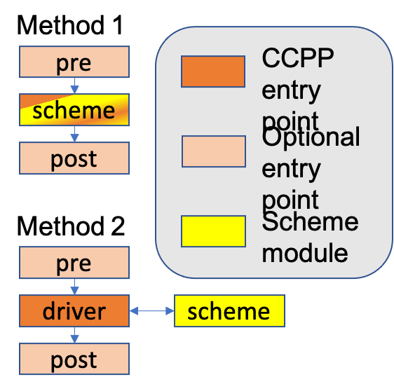

.. _AddNewSchemes:

****************************************
Connecting a scheme to CCPP
****************************************

This chapter contains a brief description on how to add a :term:`scheme` to the :term:`CCPP Physics` pool. Aside from the basic design elements for interoperability (:term:`entry points <entry point>`, metadata files), most CCPP requirements simply follow from coding best practices.

     .. note:: The instructions in this chapter assume the user is implementing this scheme for use with the CCPP Single-Column model (:term:`SCM`); not only is the SCM more lightweight than a full 3D NWP model for development purposes, but using the SCM as a :term:`host model` is a requirement for all new CCPP schemes for testing purposes. For implementation in another host model, especially for adding new variables, some modifications to that host model's metadata may be required; see :numref:`Chapter %s <Host-side Coding>` for details

==============================
Criteria for inclusion in CCPP
==============================

CCPP governance, including interests from NOAA, NCAR, and developers of existing schemes, have decided on the following criteria for including new schemes in the CCPP physics repository.
Because there is some subjectivity in these items, and requirements may change over time, we encourage developers of prospective CCPP schemes to reach out via `Github discussions <https://github.com/NCAR/ccpp-physics/discussions>`_ at an early stage.

* The scheme must be sufficiently different from schemes already in the CCPP Physics repository.
* The scheme should be either

  * desired by an organization participating in the funding of CCPP or
  * the scheme’s development and/or testing is a funded project of a CCPP-sponsor organization.

* The scheme must be compiled/run with at least one CCPP-compliant host model, and pass that host model's regression tests.
* The scheme must be documented, ideally with references to published scientific results.
* The scheme must have developer support, or at least a point-of-contact for reviewing code changes.

==============================
Preparing a scheme for CCPP
==============================
There are a few steps that can be taken to prepare a scheme for addition to CCPP prior to starting the process of implementing it in the CCPP Framework:

1. Remove/refactor any incompatible features described in :numref:`Section %s <CodingRules>`. This includes updating Fortran code to at least Fortran 90 standards, removing ``STOP`` and ``GOTO`` statements, removing common blocks, and refactoring any other disallowed features.
2. Make an inventory of all variables that are inputs and/or outputs to the scheme. Check the file ``ccpp-framework/doc/DevelopersGuide/CCPP_VARIABLES_SCM.pdf`` to see if each variable has already been implemented in the single column model. If there are variables that are not available, see :numref:`Section %s <Adding new variables to CCPP>`.

=============================
Implementing a scheme in CCPP
=============================

There are, broadly speaking, two approaches for connecting an existing physics scheme to the CCPP Framework:

1. Refactor the existing scheme to CCPP format standards, using ``pre_`` and ``post_`` :term:`interstitial schemes <interstitial scheme>` to interface to and from the existing scheme if necessary.
2. Create a driver scheme as an interface from the existing scheme's Fortran module to the CCPP Framework.

   *Diagram of the methods described in this section.*

Method 1 is the preferred method of adapting a scheme to CCPP. This involves making modifications to the original scheme so that it is CCPP-compliant (see :numref:`Chapter %s <CompliantPhysParams>`), containing subroutines that correspond to CCPP entry points (i.e. ``{schemename}_init``, ``{schemename}_run``, etc.) as necessary. It should be accompanied by appropriate metadata files (see :numref:`Section %s <MetadataRules>`), and it must be updated to remove any disallowed features as listed in :numref:`Section %s <CodingRules>`.

While method 1 is preferred, there are cases where method 1 may not be possible: for example, in schemes that are shared with other, non-CCPP hosts, and so require specialized, model-specific drivers, and might be beholden to different coding standards required by another model. In cases such as this, method 2 may be employed.

Method 2 involves fewer changes to the original scheme's Fortran module: A CCPP-compliant driver module (see :numref:`Chapter %s <CompliantPhysParams>`) handles defining the inputs to and outputs from the scheme module in terms of state variables, constants, and tendencies provided by the model as defined in the scheme's .meta file. The calculation of variables that are not available directly from the model, and conversion of scheme output back into the variables expected by CCPP, should be handled by interstitial schemes (``schemename_pre`` and ``schemename_post``). While this method puts most CCPP-required features in the driver and interstitial subroutines, the original scheme must still be updated to remove STOP statements, common blocks, or any other disallowed features as listed in :numref:`Section %s <CodingRules>`.

For both methods, optional interstitial schemes can be used for code that can not be handled within the scheme itself. For example, if different code needs to be run for coupling with other schemes or in different orders (e.g. because of dependencies on other schemes and/or the order the scheme is run in the :term:`SDF`), or if variables needed by the scheme must be derived from variables provided by the host. See  :numref:`Chapter %s <CompliantPhysParams>` for more details on primary and interstitial schemes.

     .. note:: Depending on the complexity of the scheme and how it works together with other schemes, multiple interstitial schemes may be necessary.

------------------------------
Adding new variables to CCPP
------------------------------

This section gives guidance on adding new variables to the CCPP, which is often necessary when adding a new scheme or adding capabilities to an existing one.

     .. note:: The instructions in this chapter assume the user is implementing this scheme for use in the CCPP Single-Column model (SCM). Other host model variables can be found in different files; see :numref:`Chapter %s <Host-side Coding>` for details

The first step is to be absolutely sure that a new variable is required: the desired variable may already be included in the CCPP for use by other schemes. Check the metadata information in ``CCPP_typedefs.meta`` or the file ``ccpp-framework/doc/DevelopersGuide/CCPP_VARIABLES_SCM.pdf`` generated by ``ccpp_prebuild.py``. If all quantities needed by the scheme are already available as variables in CCPP, they can be invoked in the scheme's metadata file without any further work necessary.

If an input variable needed by the scheme is not available, first consider if it can be calculated from the existing CCPP variables. If so, an :term:`interstitial scheme` (such as ``schemename_pre``; see  :numref:`Chapter %s <CompliantPhysParams>` for more details) can be created to calculate the variable(s). If this path is taken, the variable must be defined (but not initialized) in the :term:`host model`, as the memory for this variable must be allocated by the host. Instructions for how to add variables on the host model side can be found in :numref:`Chapter %s <Host-side Coding>`.

     .. note:: The CCPP Framework is capable of performing automatic unit conversions between variables provided by the host model and variables required by the new scheme. See :numref:`Section %s <AutomaticUnitConversions>` for details.

If an entirely new variable needs to be added, consult the CCPP standard names dictionary and the rules for creating new :term:`standard names <standard name>` at https://github.com/escomp/CCPPStandardNames. If in doubt, use the GitHub discussions page in the CCPP Framework repository (https://github.com/ncar/ccpp-framework) to discuss the suggested new standard name(s) with the CCPP developers.

     .. note:: It is important to keep in mind that not all data types are persistent in memory. If the value of a variable must be remembered from one call to the next, it should not be in the interstitial or diagnostic data types. Most variables in the interstitial data type are reset (to zero or other initial values) at the beginning of a physics :term:`group` and do not persist from one :term:`set` to another or from one group to another. The diagnostic data type is periodically reset because it is used to accumulate variables for given time intervals. However, there is a small subset of interstitial variables that are set at creation time and are not reset; these are typically dimensions used in other interstitial variables.

For variables that can be set via namelist, the ``GFS_control_type`` Derived Data Type (DDT) should be used. In this case, it is also important to modify the namelist file to include the new variable.

If information from the previous timestep is needed, it is important to identify if the host model provides this information, or if it needs to be stored as a special variable. For example, in the Model for Prediction Across Scales (MPAS), variables containing the values of several quantities in the preceding timesteps are available. When that is not the case, as in the :term:`UFS Atmosphere`, interstitial schemes are needed to access these quantities.

     .. note:: As an example, the reader is referred to the `Grell-Freitas convective scheme <https://dtcenter.ucar.edu/GMTB/v7.0.0p/sci_doc/_c_u__g_f.html>`_, which makes use of interstitials to obtain the previous timestep information.

Consider allocating the new variable only when needed (i.e. when the new scheme is used and/or when a certain control flag is set). If this is a viable option, following the existing examples in ``CCPP_typedefs.F90`` and ``GFS_typedefs.meta`` for allocating the variable and setting the ``active`` attribute in the metadata correctly.

----------------------------------
Incorporating a scheme into CCPP
----------------------------------
The new scheme and any interstitials will need to be added to the CCPP prebuild configuration file. Add the new scheme to the Python dictionary in `ccpp-scm/ccpp/config/ccpp_prebuild_config.py <https://github.com/NCAR/ccpp-scm/blob/main/ccpp/config/ccpp_prebuild_config.py>`__ using the same path as the existing schemes:

.. code-block::

   SCHEME_FILES = [ ...
   '../some_relative_path/existing_scheme.F90',
   '../some_relative_path/new_scheme.F90',
   ...]

     .. note:: Different host models will have different prebuild config files. For example, the :term:`UFS Atmosphere's <UFS Atmosphere>` config file is located at `ufs-weather-model/FV3/ccpp/config/ccpp_prebuild_config.py <https://github.com/NOAA-EMC/fv3atm/blob/develop/ccpp/config/ccpp_prebuild_config.py>`__

The source code and ``.meta`` files for the new scheme should be placed in the same directory. Individual schemes are contained in their own subdirectory within the ccpp-physics repository under the ``physics/`` directory, optionally under a directory describing the type of physics scheme. For example, the Grell-Freitas convective scheme is located in the ccpp-physics repository at `physics/CONV/Grell_Freitas <https://github.com/NCAR/ccpp-physics/tree/main/physics/CONV/Grell_Freitas>`__

To add this new scheme to a suite definition file (:term:`SDF`) for running within a :term:`host model`, follow the examples found in `ccpp-scm/ccpp/suites <https://github.com/NCAR/ccpp-scm/tree/main/ccpp/suites>`__. For more information about suites and SDFs, see :numref:`Chapter %s <ConstructingSuite>`.

     .. note:: For the :term:`UFS Atmosphere`, suites can be found in the `ufs-weather-model/FV3/ccpp/suites <https://github.com/NOAA-EMC/fv3atm/tree/develop/ccpp/suites>`__ directory

No further modifications of the build system are required, since the :term:`CCPP Framework` will auto-generate the necessary makefiles that allow the host model to compile the scheme.

------------------------------------
Time-split vs. process-split schemes
------------------------------------

One decision that will need to be made when incorporating a new scheme into CCPP is whether the scheme will be intended to be run as a time-split scheme or a process-split scheme:

* A *process-split* scheme is one that is intended to use the host model's atmospheric state as an input, independent of state modifications made by other schemes that may or may not be called before this scheme. In this case, the resulting atmospheric state after a :term:`group` of schemes is executed can be simply calculated by applying the tendencies from each individual scheme to the initial atmospheric state prior to the calling of the physics group.
* A *time-split* scheme is one that may work with a modified atmospheric state resulting from the previous application of one or more other time-split schemes. In this case, special care must be taken when applying tendencies to the atmospheric state, to ensure that both this and subsequent schemes are making the correct assumptions about the intput and output atmospheric state. Additionally, the order schemes appear within a group for a given SDF must be considered carefully.

Currently the CCPP Physics contains a mix of process-split and time-split schemes, with the different strategies being handled by host-specific interstitial schemes. Future releases of CCPP will include a more robust system for handling these differences in the methods updating the atmospheric state.

==================================
Testing and debugging a new scheme
==================================

Before running this new scheme, check for consistency between the namelist and the :term:`SDF`. There is no default consistency check between the SDF and the namelist unless the developer adds one. Errors such as segmentation faults may occur if this consistency is not upheld, due to appropriate arrays not being allocated.

To test a new scheme that has been added to the :term:`SCM`, compile the SCM with a suite definition file that contains the newly added scheme.

Some tips for debugging problems:

* Segmentation faults are often related to variables and array allocations.
* As mentioned above, make sure the SDF and namelist are compatible. Inconsistencies may result in segmentation faults because arrays are not allocated or in unintended scheme(s) being executed.
* Make sure to use an uppercase suffix ``.F90`` to enable C preprocessing.
* A scheme called GFS_debug (GFS_debug.F90) may be added to the SDF where needed to print state variables and interstitial variables. If needed, edit the scheme beforehand to add new variables that need to be printed.
* Check the ``ccpp_prebuild.py`` script for success/failure and associated messages; run the prebuild script with the --debug and --verbose flags. See :numref:`Chapter %s <ConstructingSuite>` for more details
* Compile code in DEBUG mode (see section 4.3 of the `SCM User's Guide <https://ccpp-scm.readthedocs.io/en/latest/chap_quick.html#compiling-scm-with-ccpp>`_, run through debugger if necessary (gdb, Linaro/Arm DDT, totalview, …).
* Use memory check utilities such as ``valgrind``.
* Double-check the metadata file associated with your scheme to make sure that all information, including standard names and units, correspond to the correct local variables.

