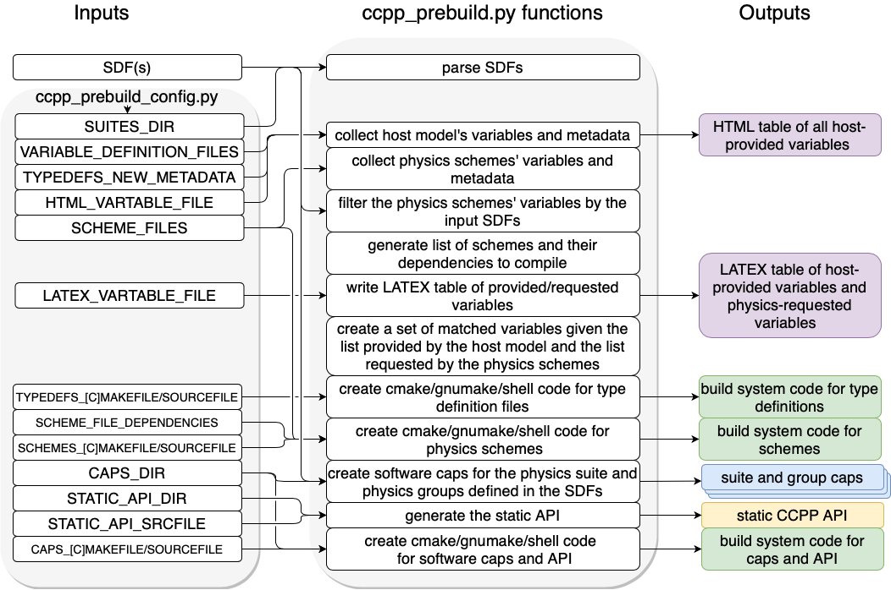

.. _CCPPPreBuild:

**************************************************
Technical Aspects of the CCPP *Prebuild*
**************************************************

=============================
*Prebuild* Script Function
=============================

The :term:`CCPP` *prebuild* script ``ccpp-framework/scripts/ccpp_prebuild.py`` is the central piece of code in the :term:`CCPP Framework` that
connects the :term:`host model` with the :term:`CCPP Physics` schemes (see :numref:`%s <ccpp_static_build>`). This script must be run
before compiling the CCPP Physics library and the host model cap. This may be done manually or as part
of a host model build-time script. Both the :term:`UFS` and :term:`SCM` have incorporated the calls to ``ccpp_prebuild.py`` in their build systems.

The CCPP *prebuild* script automates several tasks based on the information collected from the metadata
on the host model side and from the individual physics schemes (``.meta`` files; see :numref:`Figure %s <ccpp_prebuild>`):

 * Compiles a list of variables provided by the host model.
 
 * Compiles a list of variables required to run all schemes in the CCPP Physics pool.

 * Matches these variables by their ``standard_name``, checks for missing variables and mismatches of their
   attributes (e.g., units, rank, type, kind). Performs automatic unit conversions if a mismatch of units
   is detected between a scheme and the host model (see :numref:`Section %s <AutomaticUnitConversions>` for details).

 * Filters out unused variables for a given :term:`suite`.

 * Autogenerates software caps as appropriate:

    * The script generates :term:`caps <physics cap>` for the suite as a whole and physics :term:`groups<group>` as defined in the input
      :term:`SDF`\ s; in addition, the CCPP API for the build is generated.

 * Populates makefiles with kind/type definitions, schemes, caps. Statements to compile the CCPP API are included as well.

.. _ccpp_prebuild:

   *Schematic of tasks automated by the* ``ccpp_prebuild.py`` *script and associated inputs and outputs. The majority of the input is controlled through the host-model dependent* ``ccpp_prebuild_config.py`` *, whose user-editable variables are included as all-caps within the* ``ccpp_prebuild_config.py`` *bubble. Outputs are color-coded according to their utility: purple outputs are informational only (useful for developers, but not necessary to run the code), yellow outputs are used within the host model, blue outputs are connected to the physics, and green outputs are used in the model build.*

=============================
Script Configuration
=============================

To connect the CCPP with a host model ``XYZ``, a Python-based configuration file for this model must be created in the host model’s repository. The easiest way is to copy an existing configuration file for the SCM in sub-directory ``ccpp/config`` of the ccpp-scm repository. The configuration in ``ccpp_prebuild_config.py`` depends largely on (a) the directory structure of the host model itself, (b) where the ``ccpp-framework`` and the ``ccpp-physics`` directories are located relative to the directory structure of the host model, and (c) from which directory the ``ccpp_prebuild.py`` script is executed before/during the build process (this is referred to as basedir in ``ccpp_prebuild_config_XYZ.py``).

:ref:`Listing 8.1 <ccpp_prebuild_example>` contains an example for the CCPP-SCM prebuild config. Here, both ``ccpp-framework`` and ``ccpp-physics`` are located in directories ``ccpp/framework`` and ``ccpp/physics`` of the top-level directory of the host model, and ``ccpp_prebuild.py`` is executed from the same top-level directory.

.. _ccpp_prebuild_example:

.. code-block:: console

   # Host model identifier
   HOST_MODEL_IDENTIFIER = "SCM"

   # Add all files with metadata tables on the host model side,
   # relative to basedir = top-level directory of host model
   VARIABLE_DEFINITION_FILES = [
       'scm/src/scm_type_defs.F90',
       'scm/src/scm_physical_constants.F90',
       ]

    # How parent variables (module variables, derived data types)
    # are referenced in the model
    TYPEDEFS_NEW_METADATA = {
        'ccpp_types' : {
            'ccpp_types' : '',
            'ccpp_t' : 'cdata',
            },
        'GFS_typedefs' : {
            'GFS_typedefs' : '',
            'GFS_control_type' : 'physics%Model',
            },
        }

   # Add all physics scheme files relative to basedir
   SCHEME_FILES = {
       ’ccpp/physics/physics/GFS_DCNV_generic.f90’ ,
       'ccpp/physics/physics/sfc_sice.f’,
       }

    # Default build dir, relative to current working directory,
    # if not specified as command-line argument
    DEFAULT_BUILD_DIR = 'scm/bin'

    # Auto-generated makefile/cmakefile snippets that contain all type definitions
    TYPEDEFS_MAKEFILE   = '{build_dir}/ccpp/physics/CCPP_TYPEDEFS.mk'
    TYPEDEFS_CMAKEFILE  = '{build_dir}/ccpp/physics/CCPP_TYPEDEFS.cmake'
    TYPEDEFS_SOURCEFILE = '{build_dir}/ccpp/physics/CCPP_TYPEDEFS.sh'

    # Auto-generated makefile/cmakefile snippets that contain all schemes
    SCHEMES_MAKEFILE = '{build_dir}/ccpp/physics/CCPP_SCHEMES.mk'
    SCHEMES_CMAKEFILE = '{build_dir}/ccpp/physics/CCPP_SCHEMES.cmake'
    SCHEMES_SOURCEFILE = '{build_dir}/ccpp/physics/CCPP_SCHEMES.sh'

    # Auto-generated makefile/cmakefile snippets that contain all caps
    CAPS_MAKEFILE = '{build_dir}/ccpp/physics/CCPP_CAPS.mk'
    CAPS_CMAKEFILE = '{build_dir}/ccpp/physics/CCPP_CAPS.cmake'
    CAPS_SOURCEFILE = '{build_dir}/ccpp/physics/CCPP_CAPS.sh'

    # Directory where to put all auto-generated physics caps
    CAPS_DIR = '{build_dir}/ccpp/physics/physics'

    # Directory where the suite definition files are stored
    SUITES_DIR = 'ccpp/suites'

    # Directory where to write static API to
    STATIC_API_DIR = 'scm/src/'
    STATIC_API_SRCFILE = 'scm/src/CCPP_STATIC_API.sh'

    # Directory for writing HTML pages generated from metadata files
    METADATA_HTML_OUTPUT_DIR = 'ccpp/physics/physics/docs'

    # HTML document containing the model-defined CCPP variables
    HTML_VARTABLE_FILE = 'ccpp/physics/CCPP_VARIABLES_SCM.html'

    # LaTeX document containing the provided vs requested CCPP variables
    LATEX_VARTABLE_FILE = 'ccpp/framework/doc/DevelopersGuide/CCPP_VARIABLES_SCM.tex'

*Listing 8.1: CCPP prebuild config for SCM (shortened)*

Although most of the variables in the ``ccpp_prebuild_config.py`` script are described by in-line comments in the code listing above and their use is described in :numref:`Figure %s <ccpp_prebuild>`, some clarifying comments are in order. The ``SCHEME_FILES`` variable is a list of CCPP-compliant physics scheme entry/exit point source files only, their dependencies are not listed here (see :numref:`Section %s <MetadataRules>` for how dependencies are included). ``TYPEDEFS_NEW_METADATA`` is a dictionary that, for each Fortran module name contained in the files in ``VARIABLE_DEFINITION_FILES`` (the key of the dictionary), contains a nested dictionary (the value) that describes how the module itself and the derived data types are referenced in the host model. For the module itself, an empty string is typically the correct choice. For each of the derived data types contained in the module, a Fortran variable expression is required, as shown in the listing above. This entry is needed to correctly identify and pass parent variables (derived data types) of variables that are needed by the physics to the auto-generated caps.

=============================
Running ccpp_prebuild.py
=============================

Once the configuration in ``ccpp_prebuild_config.py`` is complete, the ``ccpp_prebuild.py`` script can be run from a specific directory, dependent on the host model. For the SCM, this is the top level directory, i.e. the correct call to the script is ``./ccpp/framework/scripts/ccpp_prebuild.py``. For the :term:`UFS Atmosphere` host model, the script needs to be called from subdirectory ``FV3/ccpp``, relative to the top-level ``ufs-weather-model`` directory. In the following, we use the SCM directory structure. Note that for both SCM and UFS, the ``ccpp_prebuild.py`` script is called automatically by the build system.

For developers adding a CCPP-compliant physics scheme, running ``ccpp_prebuild.py`` periodically is recommended to check that the metadata provided with the physics schemes matches what the host model provided. As alluded to above, the ``ccpp_prebuild.py`` script has six command line options, with the path to a host-model specific configuration file (``--config``) being the only required option:

 |  ``-h, --help``         show this help message and exit
 |  ``--config``           ``PATH_TO_CONFIG/config_file``      path to CCPP *prebuild* configuration file
 |  ``--clean``            remove files created by this script, then exit
 |  ``--verbose``          enable verbose output
 |  ``--debug``            enable additional checks on array sizes
 |  ``--suites`` SUITES    SDF(s) to use (comma-separated, without path)

An example invocation of running the script (called from the SCM’s top level directory) would be:

.. code-block:: console

   ./ccpp/framework/scripts/ccpp_prebuild.py \
     --config=./ccpp/config/ccpp_prebuild_config.py \
     --suites=FV3_GFS_v16 \
     --verbose

which uses a configuration script located at the specified path. The ``--verbose`` option can be used for more verbose output from the script.

The :term:`SDF`\(s) to compile into the executable can be specified using the ``--suites`` command-line argument. Such files are included with the SCM and ufs-weather-model repositories, and must be included with the code of any host model to use the CCPP.  An example of a build using two SDFs is:

.. code-block:: console

   ./ccpp/framework/scripts/ccpp_prebuild.py \
     --config=./ccpp/config/ccpp_prebuild_config.py \
     --suites=FV3_GFS_v16,RRFS_v1beta

.. note::

   If the ``--suites`` option is omitted, all suites will be compiled into the executable.

The ``--debug`` command-line argument enables additional checks on array sizes inside the auto-generated software caps, prior to entering any of the schemes.

If the CCPP *prebuild* step is successful, the last output line will be:

``INFO: CCPP prebuild step completed successfully.``

To remove all files created by ``ccpp_prebuild.py``, for example as part of a host model’s ``make clean`` functionality, execute the same command as before, but with ``--clean`` appended:

.. code-block:: console

  ./ccpp/framework/scripts/ccpp_prebuild.py --config=./ccpp/config/ccpp_prebuild_config.py \
  --suites=FV3_GFS_v16,RRFS_v1beta --clean

=============================
Troubleshooting
=============================

If invoking the ``ccpp_prebuild.py`` script fails, some message other than the success message will be written to the terminal output. Specifically, the terminal output will include informational logging messages generated from the script and any error messages written to the Python logging utility. Some common errors (minus the typical logging output and traceback output) and solutions are described below, with non-bold font used to denote aspects of the message that will differ depending on the problem encountered. This is not an exhaustive list of possible errors, however. For example, in this version of the code, there is no cross-checking that the metadata information provided corresponds to the actual Fortran code, so even though ``ccpp_prebuild.py`` may complete successfully, there may be related compilation errors later in the build process. For further help with an undescribed error, you can make a post in the appropriate GitHub discussions forum for *CCPP Physics* (https://github.com/NCAR/ccpp-physics/discussions) or *CCPP Framework* (https://github.com/NCAR/ccpp-framework/discussions). 

 #. ``ERROR: Configuration file`` erroneous/path/to/config/file ``not found``
      * Check that the path entered for the ``--config`` command line option points to a readable configuration file.
 #. ``KeyError``: 'erroneous_scheme_name' when using the ``--suites`` option
      * This error indicates that a scheme within the supplied :term:`SDF`\s does not match any scheme names found in the SCHEME_FILES variable of the supplied configuration file that lists scheme source files. Double check that the scheme’s source file is included in the SCHEME_FILES list and that the scheme name that causes the error is spelled correctly in the supplied SDFs and matches what is in the source file (minus any ``*_timestep_init``, ``*_init``, ``*_run``, ``*_finalize``, ``*_timestep_finalize`` suffixes).
 #. ``CRITICAL: Suite definition file`` erroneous/path/to/SDF.xml ``not found``.

    ``Exception: Parsing suite definition file`` erroneous/path/to/SDF.xml ``failed``.
      * Check that the path ``SUITES_DIR`` in the CCPP prebuild config and the names entered for the ``--suites`` command line option are correct.
 #. ``INFO: Parsing metadata tables for variables provided by host model`` …

    ``IOError: [Errno 2] No such file or directory``: 'erroneous_file.f90'
      * Check that the paths specified in the ``VARIABLE_DEFINITION_FILES`` of the supplied configuration file are valid and contain CCPP-compliant host model snippets for insertion of metadata information. (see :ref:`example <SnippetMetadata>`)
 #. ``Exception: Error parsing variable entry`` "erroneous variable metadata table entry data" ``in argument table`` variable_metadata_table_name
      * Check that the formatting of the metadata entry described in the error message is OK.
 #. ``Exception: New entry for variable`` var_name ``in argument table`` variable_metadata_table_name ``is incompatible with existing entry``:
     | ``Existing: Contents of <mkcap.Var object at 0x10299a290> (* = mandatory for compatibility)``:
     |  ``standard_name`` = var_name *
     |  ``long_name``     =
     |  ``units``         = various *
     |  ``local_name``    =
     |  ``type``          = real *
     |  ``rank``          = (:,:,:) *
     |  ``kind``          = kind_phys *
     |  ``intent``        = none
     |  ``active``        = T
     |  ``target``        = None
     |  ``container``     = MODULE_X TYPE_Y
     | ``vs. new: Contents of <mkcap.Var object at 0x10299a310> (* = mandatory for compatibility)``:
     |  ``standard_name`` = var_name *
     |  ``long_name``     =
     |  ``units``         = frac *
     |  ``local_name``    =
     |  ``type``          = real *
     |  ``rank``          = (:,:) *
     |  ``kind``          = kind_phys *
     |  ``intent``        = none
     |  ``active``        = T
     |  ``target``        = None
     |  ``container``     = MODULE_X TYPE_Y

     * This error is associated with a variable that is defined more than once (with the same :term:`standard name`) on the host model side. Information on the offending variables is provided so that one can provide different standard names to the different variables.
 #. ``Exception: Scheme name differs from module name``: ``module_name``\= "X" vs. ``scheme_name``\= "Y"
      * Make sure that each scheme in the errored module begins with the module name and ends in either ``*_timestep_init``, ``*_init``, ``*_run``, ``*_finalize``, or ``*_timestep_finalize``.
 #. ``Exception: New entry for variable`` var_name ``in argument table of subroutine`` scheme_subroutine_name ``is incompatible with existing entry``:
     | ``existing: Contents of <mkcap.Var object at 0x10299a290> (* = mandatory for compatibility)``:
     |  ``standard_name`` = var_name *
     |  ``long_name``     =
     |  ``units``         = various *
     |  ``local_name``    =
     |  ``type``          = real *
     |  ``rank``          = (:,:,:) *
     |  ``kind``          = kind_phys *
     |  ``intent``        = none
     |  ``active``        = T
     |  ``target``        = None
     |  ``container``     = MODULE_X TYPE_Y
     | ``vs. new: Contents of <mkcap.Var object at 0x10299a310> (* = mandatory for compatibility)``:
     |  ``standard_name`` = var_name *
     |  ``long_name``     =
     |  ``units``         = frac *
     |  ``local_name``    =
     |  ``type``          = real *
     |  ``rank``          = (:,:) *
     |  ``kind``          = kind_phys *
     |  ``intent``        = none
     |  ``active``        = T
     |  ``target``        = None
     |  ``container``     = MODULE_X TYPE_Y

     * This error is associated with physics scheme variable metadata entries that have the same standard name with different mandatory properties (either units, type, rank, or kind currently -- those attributes denoted with a ``*``). This error is distinguished from the error described in 8 above, because the error message mentions “in argument table of subroutine” instead of just “in argument table”.
 #. ``ERROR: Variable`` X ``requested by MODULE_``\Y ``SCHEME_``\Z ``SUBROUTINE_``\A ``not provided by the model``
     ``Exception: Call to compare_metadata failed.``

     * A variable requested by one or more physics schemes is not being provided by the host model. If the variable exists in the host model but is not being made available for the CCPP, an entry must be added to one of the host model variable metadata sections.
 #. ``ERROR:   error, variable`` X ``requested by MODULE_``\Y ``SCHEME_``\Z ``SUBROUTINE_``\A ``cannot be identified unambiguously. Multiple definitions in MODULE_``\Y ``TYPE_``\B
      * A variable is defined in the host model variable metadata more than once (with the same standard name). Remove the offending entry or provide a different standard name for one of the duplicates.
 #. ``ERROR:   incompatible entries in metadata for variable`` var_name:
     | ``provided:  Contents of <mkcap.Var object at 0x104883210> (* = mandatory for compatibility)``:
     |  ``standard_name`` = var_name *
     |  ``long_name``     =
     |  ``units``         = K *
     |  ``local_name``    =
     |  ``type``          = real *
     |  ``rank``          =  *
     |  ``kind``          = kind_phys *
     |  ``intent``        = none
     |  ``active``        = T
     |  ``target``        = None
     |  ``container``     =
     | ``requested: Contents of <mkcap.Var object at 0x10488ca90> (* = mandatory for compatibility)``:
     |  ``standard_name`` = var_name *
     |  ``long_name``     =
     |  ``units``         = none *
     |  ``local_name``    =
     |  ``type``          = real *
     |  ``rank``          =  *
     |  ``kind``          = kind_phys *
     |  ``intent``        = in
     |  ``active``        = T
     |  ``target``        = None
     |  ``container``     =
 #. ``Exception: Call to compare_metadata failed``.
      * This error indicates a mismatch between the attributes of a variable provided by the host model and what is requested by the physics. Specifically, the units, type, rank, or kind don’t match for a given variable standard name. Double-check that the attributes for the provided and requested mismatched variable are accurate. If after checking the attributes are indeed mismatched, reconcile as appropriate (by adopting the correct variable attributes either on the host or physics side).

Note: One error that the ``ccpp_prebuild.py`` script will not catch is if a physics scheme lists a variable in its actual (Fortran) argument list without a corresponding entry in the subroutine’s variable metadata. This will lead to a compilation error when the autogenerated scheme cap is compiled:

``Error: Missing actual argument for argument 'X' at (1)``

========================================================
CCPP Stub Build
========================================================

New in version 6.0, CCPP includes a *stub* capability, which will build the appropriate basic software caps needed for the compilation of the :term:`host model`, but not include any of the physics itself. This can be useful for host model debugging, testing "dry" dynamics with no parameterizations, and other use cases where building the whole CCPP physics library would be unnecessary. Currently this capability is only supported for the :term:`UFS Atmosphere`.

To create the stub software caps, rather than using the host configuration file as described above,
users can use the provided stub config file ``ccpp/framework/stub/ccpp_prebuild_config.py``. From the ``ccpp/framework/stub`` directory,
the prebuild script can be called in this manner to use the CCPP stub build:

.. code-block:: console

   ../scripts/ccpp_prebuild.py --config=ccpp_prebuild_config.py
   cmake . 2>&1 | tee log.cmake
   make 2>&1 | tee log.make

The rest of the UFS Atmosphere build can proceed as normal.

========================================================
CCPP Physics Variable Tracker
========================================================

New in version 6.0, CCPP includes a tool that allows users to track a given variable's journey
through a specified physics suite. This tool, ``ccpp-framework/scripts/ccpp_track_variables.py``,
given a :term:`suite definition file<SDF>` and the :term:`standard name` of a variable, 
will output the list of subroutines that use this variable -- in the order that they are called --
as well as the variable's Fortran *intent*
(``in``, ``out``, or ``inout``) within that subroutine. This can allow the user to more easily
determine where specific errors, biases, or other influences on a specific variable or variables
might originate from within the physics suite. The ``--help`` option will give a basic rundown of
how to use the script:

.. code-block:: console

   ./ccpp_track_variables.py --help
   usage: ccpp_track_variables.py [-h] -s SDF -m METADATA_PATH -c CONFIG -v VARIABLE [--debug]

   optional arguments:
     -h, --help            show this help message and exit
     -s SDF, --sdf SDF     suite definition file to parse
     -m METADATA_PATH, --metadata_path METADATA_PATH
                           path to CCPP scheme metadata files
     -c CONFIG, --config CONFIG
                           path to CCPP prebuild configuration file
     -v VARIABLE, --variable VARIABLE
                           variable to track through CCPP suite
     --debug               enable debugging output

For this initial implementation, this script must be executed from within a :term:`host model`, and must be
called from the same directory that the ``ccpp_prebuild.py`` script is called from. This first 
example is called using the :term:`UFS Atmosphere` as a host model, from the directory ``ufs-weather-model/FV3/ccpp``:

.. code-block:: console

   framework/scripts/ccpp_track_variables.py -c=config/ccpp_prebuild_config.py \
     -s=suites/suite_FV3_RRFS_v1beta.xml -v air_temperature_of_new_state -m ./physics/physics/
   For suite suites/suite_FV3_RRFS_v1beta.xml, the following schemes (in order for each group) use the variable air_temperature_of_new_state:
   In group physics
     GFS_suite_stateout_reset_run (intent out)
     dcyc2t3_run (intent in)
     GFS_suite_stateout_update_run (intent out)
     ozphys_2015_run (intent in)
     get_phi_fv3_run (intent in)
     GFS_suite_interstitial_3_run (intent in)
     GFS_MP_generic_pre_run (intent in)
     mp_thompson_pre_run (intent in)
     mp_thompson_run (intent inout)
     mp_thompson_post_run (intent inout)
     GFS_MP_generic_post_run (intent in)
     maximum_hourly_diagnostics_run (intent in)
   In group stochastics
     GFS_stochastics_run (intent inout)

In the example above, we can see that the variable ``air_temperature_of_new_state`` is used in
the FV3_RRFS_v1beta suite by several microphysics-related schemes, as well as by the stochastics :term:`parameterization`.

To learn more about a given subroutine, you can search the physics source code within the ``ccpp-physics`` repository,
or you can consult the `CCPP Scientific Documentation
<https://dtcenter.ucar.edu/GMTB/v6.0.0/sci_doc/>`_: typing the subroutine name into the search
bar should lead you to further information about the subroutine and how it ties into its associated physics scheme.
In addition, because of the naming conventions for subroutines in CCPP-compliant physics schemes, 
we can typically see which scheme, as well as which :term:`phase` within that scheme, is associated with the listed subroutine,
without having to consult any further documentation or source code. For example, the ``mp_thompson_run``
subroutine is part of the Thompson microphysics scheme, specifically the *run* phase of that scheme.

This second example is called using the :term:`SCM` as a host model:

.. code-block:: console

   ccpp/framework/scripts/ccpp_track_variables.py --config=ccpp/config/ccpp_prebuild_config.py \
      -s=ccpp/suites/suite_SCM_GFS_v17_p8.xml -v surface_friction_velocity_over_land -m ./ccpp/physics/physics/
   For suite ccpp/suites/suite_SCM_GFS_v17_p8.xml, the following schemes (in order for each group) use the variable surface_friction_velocity_over_land:
   In group physics
     GFS_surface_composites_pre_run (intent inout)
     sfc_diff_run (intent inout)
     noahmpdrv_run (intent inout)
     sfc_diff_run (intent inout)
     noahmpdrv_run (intent inout)
     GFS_surface_composites_post_run (intent in)

In the example above, we can see that the variable ``wind_speed_at_lowest_model_layer`` is used in a few subroutines,
two of which (``sfc_diff_run`` and ``noahmpdrv_run`` are listed twice). This is not an error! The
two repeated subroutines are part of a scheme called in a :term:`subcycle <subcycling>`, and so they are called twice in this cycle as designated in the SDF.
The ``ccpp_track_variables.py`` script lists the subroutines in the exact order they are called (within each *group*), including subcycles.

Some standard names can be exceedingly long and hard to remember, and it is not always convenient to search the full list of standard names for the exact variable you want. Therefore, this script will also return matches for partial variable names. In this example, we will look for the variable "velocity", which is not a standard name of any variable, and see what it returns:

.. code-block:: console

   framework/scripts/ccpp_track_variables.py --config=config/ccpp_prebuild_config.py \
      -s=suites/suite_FV3_GFS_v16.xml -v velocity -m ./physics/physics/
   Variable velocity not found in any suites for sdf suites/suite_FV3_GFS_v16.xml

   ERROR:ccpp_track_variables:Variable velocity not found in any suites for sdf suites/suite_FV3_GFS_v16.xml

   Did find partial matches that may be of interest:

   In GFS_surface_composites_pre_run found variable(s) ['surface_friction_velocity', 'surface_friction_velocity_over_water', 'surface_friction_velocity_over_land', 'surface_friction_velocity_over_ice']
   In sfc_diff_run found variable(s) ['surface_friction_velocity_over_water', 'surface_friction_velocity_over_land', 'surface_friction_velocity_over_ice']
   In GFS_surface_composites_post_run found variable(s) ['surface_friction_velocity', 'surface_friction_velocity_over_water', 'surface_friction_velocity_over_land', 'surface_friction_velocity_over_ice']
   In cires_ugwp_run found variable(s) ['angular_velocity_of_earth']
   In samfdeepcnv_run found variable(s) ['vertical_velocity_for_updraft', 'cellular_automata_vertical_velocity_perturbation_threshold_for_deep_convection']

While the script did not find the variable specified, it did find several partial matches -- ``surface_friction_velocity``, ``surface_friction_velocity_over_water``, ``surface_friction_velocity_over_land``, etc. -- as well as the subroutines they were found in. You can then use this more specific information to refine your next query:

.. code-block:: console

   framework/scripts/ccpp_track_variables.py --config=config/ccpp_prebuild_config.py \
      -s=suites/suite_FV3_GFS_v16.xml -v surface_friction_velocity -m ./physics/physics/
   For suite suites/suite_FV3_GFS_v16.xml, the following schemes (in order for each group) use the variable surface_friction_velocity:
   In group physics
     GFS_surface_composites_pre_run (intent in)
     GFS_surface_composites_post_run (intent inout)

