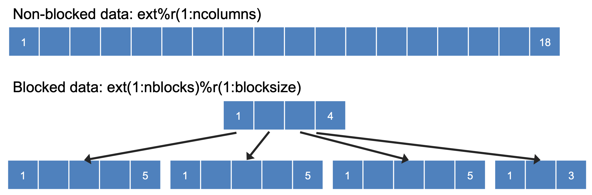

.. _Host-side Coding:

**************************************************
Host Side Coding
**************************************************

This chapter describes the connection of a host model with the pool of :term:`CCPP-Physics` schemes through the :term:`CCPP-Framework`.

==================================================
Variable Requirements on the Host Model Side
==================================================

All variables required to communicate between the host model and the physics, as well as to communicate between physics schemes, need to be allocated by the host model. An exception is variables ``errflg``, ``errmsg``, ``loop_cnt``, ``blk_no``, and ``thrd_no``, which are allocated by the CCPP-Framework, as explained in :numref:`Section %s <DataStructureTransfer>`. A list of all variables required for the current pool of physics can be found in ``ccpp/framework/doc/DevelopersGuide/CCPP_VARIABLES_XYZ.pdf`` (XYZ: SCM, FV3).

At present, only two types of variable definitions are supported by the CCPP-Framework:

* Standard Fortran variables (character, integer, logical, real) defined in a module or in the main program. For character variables, a fixed length is required. All others can have a kind attribute of a kind type defined by the host model.
* Derived data types (DDTs) defined in a module or the main program. While the use of DDTs as arguments to physics schemes in general is discouraged (see :numref:`Section %s <IOVariableRules>`), it is perfectly acceptable for the host model to define the variables requested by physics schemes as components of DDTs and pass these components to CCPP by using the correct local_name (e.g., ``myddt%thecomponentIwant``; see :numref:`Section %s <VariableTablesHostModel>`.)

.. _VariableTablesHostModel:

==================================================
Metadata for Variable in the Host Model
==================================================

To establish the link between host model variables and physics scheme variables, the host model must provide metadata information similar to those presented in :numref:`Section %s <MetadataRules>`. The host model can have multiple metadata files (``.meta``), each with the required ``[ccpp-table-properties]`` section and the related ``[ccpp-arg-table]`` sections. The host model Fortran files contain three-line snippets to indicate the location for insertion of the metadata information contained in the corresponding section in the ``.meta`` file.

.. _SnippetMetadata:

.. code-block:: fortran

   !!> \section arg_table_example_vardefs
   !! \htmlinclude example_vardefs.html
   !!

For each variable required by the pool of CCPP-Physics schemes, one and only one entry must exist on the host model side. The connection between a variable in the host model and in the physics scheme is made through its ``standard_name``.

The following requirements must be met when defining metadata for variables in the host model (see also :ref:`Listing 6.1 <example_vardefs>`
and :ref:`Listing 6.2 <example_vardefs_meta>` for examples of host model metadata).

* The ``standard_name`` must match that of the target variable in the physics scheme.
* The type, kind, shape and size of the variable (as defined in the host model Fortran code) must match that of the target variable.
* The attributes ``units``, ``rank``, ``type`` and ``kind`` in the host model metadata must match those in the physics scheme metadata.
* The attribute ``active`` is used to allocate variables under certain conditions.  It must be written as a Fortran expression that equates to ``.true.`` or ``.false.``, using the CCPP standard names of variables. ``active`` attributes for all variables are ``.true.`` by default. See :numref:`Section %s <ActiveAttribute>` for details.
* The ``intent`` attribute is not a valid attribute for host model metadata and will be ignored, if present.
* The ``local_name`` of the variable must be set to the name the host model cap uses to refer to the variable.
* The metadata section that exposes a DDT to the CCPP (as opposed to the section that describes the components of a DDT) must be in the same module where the memory for the DDT is allocated. If the DDT is a module variable, then it must be exposed via the module’s metadata section, which must have the same name as the module.
* Metadata sections describing module variables must be placed inside the module.
* Metadata sections describing components of DDTs must be placed immediately before the type definition and have the same name as the DDT.

.. _example_vardefs:

.. code-block:: fortran

       module example_vardefs

         implicit none

   !!> \section arg_table_example_vardefs
   !! \htmlinclude example_vardefs.html
   !!

         integer, parameter           :: r15 = selected_real_kind(15)
         integer                      :: ex_int
         real(kind=8), dimension(:,:) :: ex_real1
         character(len=64)            :: errmsg
         logical                      :: errflg

   !!> \section arg_table_example_ddt
   !! \htmlinclude example_ddt.html
   !!

         type ex_ddt
           logical              :: l
           real, dimension(:,:) :: r
         end type ex_ddt

         type(ex_ddt) :: ext

       end module example_vardefs

*Listing 6.1: Example host model file with reference to metadata. In this example, both the definition and the declaration (memory allocation) of a DDT* ``ext`` *(of type* ``ex_ddt`` *) are in the same module.*

.. _example_vardefs_meta:

.. code-block:: fortran

   ########################################################################
   [ccpp-table-properties]
     name = arg_table_example_vardefs
     type = module

   [ccpp-arg-table]
     name = arg_table_example_vardefs
     type = module
   [ex_int]
     standard_name = example_int
     long_name = ex. int
     units = none
     dimensions = ()
     type = integer
   [ex_real]
     standard_name = example_real
     long_name = ex. real
     units = m
     dimensions = (horizontal_loop_extent,vertical_layer_dimension)
     type = real
     kind = kind=8
   [ex_ddt]
     standard_name = example_ddt
     long_name = ex. ddt
     units = DDT
     dimensions = ()
     type = ex_ddt
   [ext]
     standard_name = example_ddt_instance
     long_name = ex. ddt inst
     units = DDT
     dimensions = ()
     type = ex_ddt
   [errmsg]
     standard_name = ccpp_error_message
     long_name = error message for error handling in CCPP
     units = none
     dimensions = ()
     type = character
     kind = len=64
   [errflg]
     standard_name = ccpp_error_code
     long_name = error code for error handling in CCPP
     units = 1
     dimensions = ()
     type = integer

   ########################################################################
   [ccpp-table-properties]
     name = arg_table_example_ddt
     type = ddt

   [ccpp-arg-table]
     name = arg_table_example_ddt
     type = ddt
   [ext%1]
     standard_name = example_flag
     long_name = ex. flag
     units = flag
     dimensions =
     type = logical
   [ext%r]
     standard_name = example_real3
     long_name = ex. real
     units = kg
     dimensions = (horizontal_loop_extent,vertical_layer_dimension)
     type = real
     kind = r15
   [ext%r(;,1)]
     standard_name = example_slice
     long_name = ex. slice
     units = kg
     dimensions = (horizontal_loop_extent,vertical_layer_dimension)
     type = real
     kind = r15
   [nwfa2d]
     standard_name = tendency_of_water_friendly_aerosols_at_surface
     long_name = instantaneous water-friendly sfc aerosol source
     units = kg-1 s-1
     dimensions = (horizontal_loop_extent)
     type = real
     kind = kind_phys
     active = (flag_for_microphysics_scheme == flag_for_thompson_microphysics_scheme .and. flag_for_aerosol_physics)
   [qgrs(:,:,index_for_water_friendly_aerosols)]
     standard_name = water_friendly_aerosol_number_concentration
     long_name = number concentration of water-friendly aerosols
     units = kg-1
     dimensions = (horizontal_loop_extent,vertical_layer_dimension)
     active = (index_for_water_friendly_aerosols > 0)
     type = real
     kind = kind_phys

*Listing 6.2: Example host model metadata file (* ``.meta`` *).*

.. _HorizontalDimensionOptionsHost:

,,,,,,,,,,,,,,,,,,,,,,,,,,,,,,,,,,,,,,,,,,,,,,,,,,,,,,,
``horizontal_dimension`` vs. ``horizontal_loop_extent``
,,,,,,,,,,,,,,,,,,,,,,,,,,,,,,,,,,,,,,,,,,,,,,,,,,,,,,,

Please refer to section :numref:`Section %s <HorizontalDimensionOptionsSchemes>` for a description of the differences between ``horizontal_dimension`` and ``horizontal_loop_extent``. The host model must define both variables to represent the horizontal dimensions in use by the physics in the metadata.

For the examples in listing :ref:`Listing 6.2 <example_vardefs_meta>`, the host model stores all horizontal grid columns of each variable in one contiguous block, and the variables ``horizontal_dimension`` and ``horizontal_loop_extent`` are identical. Alternatively, a host model could store (non-contiguous) blocks of data in an array of DDTs with a length of the total number of blocks, as shown in listing :ref:`Listing 6.3 <example_vardefs_meta_blocked_data>`. :numref:`Figure %s <ccpp_static_build>` depicts the differences in variable allocation for these two cases.

.. _example_vardefs_meta_blocked_data:

.. code-block:: fortran

   ########################################################################
   [ccpp-table-properties]
     name = arg_table_example_vardefs
     type = module

   [ccpp-arg-table]
     name = arg_table_example_vardefs
     type = module
   ...
   [ex_ddt]
     standard_name = example_ddt
     long_name = ex. ddt
     units = DDT
     dimensions = ()
     type = ex_ddt
   [ext(ccpp_block_number)]
     standard_name = example_ddt_instance
     long_name = ex. ddt inst
     units = DDT
     dimensions = ()
     type = ex_ddt
   [ext]
     standard_name = example_ddt_instance_all_blocks
     long_name = ex. ddt inst
     units = DDT
     dimensions = (ccpp_block_count)
     type = ex_ddt
   ...

   ########################################################################
   [ccpp-table-properties]
     name = arg_table_example_ddt
     type = ddt

   [ccpp-arg-table]
     name = arg_table_example_ddt
     type = ddt
   [ext%1]
     standard_name = example_flag
     long_name = ex. flag
     units = flag
     dimensions =
     type = logical
   [ext%r]
     standard_name = example_real3
     long_name = ex. real
     units = kg
     dimensions = (horizontal_loop_extent,vertical_layer_dimension)
     type = real
     kind = r15
   ...

*Listing 6.3: Example host model metadata file (* ``.meta`` *) for a host model using blocked data structures.*

.. _ccpp_blocked_data:

    *This figure depicts the difference between non-blocked (contiguous) and blocked data structures.

When blocked data structures are used by the host model, ``horizontal_loop_extent`` corresponds to the block size, and the sum of all block sizes equals ``horizontal_dimension``. In either case, the correct horizontal dimension for host model variables is ``horizontal_loop_extent``. In the time integration (run) phase, the physics are called for one block at a time (although possibly in parallel using OpenMP threading). In all other phases, the CCPP-Framework automatically combines the discontiguous blocked data into contiguous arrays before calling into a physics scheme, as shown in :ref:`Listing 6.4 <example_automatic_deblocking_of_data>`.

.. _example_automatic_deblocking_of_data:

.. code-block:: fortran

   allocate(bar_local(1:ncolumns))
   ib = 1
   do nb=1,nblocks
     bar_local(ib:ib+blocksize(nb)-1) = foo(nb)%bar
     ib = ib+blocksize(nb)
   end do

   call myscheme_init(bar=bar_local)

   ib = 1
   do nb=1,nblocks
     foo(nb)%bar = bar_local(ib:ib+blocksize(nb)-1)
     ib = ib+blocksize(nb)
   end do
   deallocate(bar_local)

*Listing 6.4: Automatic combination of blocked data structures in the auto-generated caps

.. _ActiveAttribute:

,,,,,,,,,,,,,,,,
Active Attribute
,,,,,,,,,,,,,,,,

The CCPP must be able to detect when arrays need to be allocated, and when certain tracers must be
present in order to perform operations or tests in the auto-generated caps (e.g. unit conversions,
blocked data structure copies, etc.). This is accomplished with the attribute ``active`` in the
metadata for the host model variables (e.g., ``GFS_typedefs.meta`` for the UFS Atmosphere or the SCM).

Several arrays in the host model (e.g., ``GFS_typedefs.F90`` in the UFS Atmosphere or the SCM) are
allocated based on certain conditions, for example:

.. code-block:: fortran

    !--- needed for Thompson's aerosol option
    if(Model%imp_physics == Model%imp_physics_thompson .and. Model%ltaerosol) then
      allocate (Coupling%nwfa2d (IM))
      allocate (Coupling%nifa2d (IM))
      Coupling%nwfa2d   = clear_val
      Coupling%nifa2d   = clear_val
    endif

Other examples are the elements in the tracer array, where their presence depends on the corresponding
index being larger than zero. For example:

.. code-block:: fortran

    integer              :: ntwa            !< tracer index for water friendly aerosol
    ...
    Model%ntwa             = get_tracer_index(Model%tracer_names, 'liq_aero', ...)
    ...
    if (Model%ntwa>0) then
      ! do something with qgrs(:,:,Model%ntwa)
    end if

The ``active`` attribute is a conditional statement that, if true, will allow the corresponding variable
to be allocated.  It must be written as a Fortran expression that equates to ``.true.`` or ``.false.``,
using the CCPP standard names of variables. Active attributes for all variables are ``.true.`` by default.

If a developer adds a new variable that is only allocated under certain conditions, or changes the conditions
under which an existing variable is allocated, a corresponding change must be made in the metadata for the
host model variables (``GFS_typedefs.meta`` for the UFS Atmosphere or the SCM). See variables ``nwfa2d``
and ``qgrs`` in :ref:`Listing 6.2 <example_vardefs_meta>` for an example.

========================================================
CCPP Variables in the SCM and UFS Atmosphere Host Models
========================================================

While the use of standard Fortran variables is preferred, in the current implementation of the CCPP in the UFS Atmosphere and in the SCM almost all data is contained in DDTs for organizational purposes. In the case of the SCM, DDTs are defined in ``gmtb_scm_type_defs.f90`` and ``GFS_typedefs.F90``, and in the case of the UFS Atmosphere, they are defined in both ``GFS_typedefs.F90`` and ``CCPP_typedefs.F90``.  The current implementation of the CCPP in both host models uses the following set of DDTs:

* ``GFS_init_type`` 		variables to allow proper initialization of GFS physics
* ``GFS_statein_type``	prognostic state data provided by dycore to physics
* ``GFS_stateout_type``	prognostic state after physical parameterizations
* ``GFS_sfcprop_type``	surface properties read in and/or updated by climatology, obs, physics
* ``GFS_coupling_type``	fields from/to coupling with other components, e.g., land/ice/ocean
* ``GFS_control_type``	control parameters input from a namelist and/or derived from others
* ``GFS_grid_type``		grid data needed for interpolations and length-scale calculations
* ``GFS_tbd_type``		data not yet assigned to a defined container
* ``GFS_cldprop_type``	cloud properties and tendencies needed by radiation from physics
* ``GFS_radtend_type``	radiation tendencies needed by physics
* ``GFS_diag_type``		fields targeted for diagnostic output to disk
* ``GFS_interstitial_type``	fields used to communicate variables among schemes in the slow physics group required to replace interstitial code that resided in ``GFS_{physics, radiation}_driver.F90`` in IPD
* ``GFS_data_type``	combined type of all of the above except ``GFS_control_type`` and ``GFS_interstitial_type``
* ``CCPP_interstitial_type`` fields used to communicate variables among schemes in the fast physics group

The DDT descriptions provide an idea of what physics variables go into which data type.  ``GFS_diag_type`` can contain variables that accumulate over a certain amount of time and are then zeroed out. Variables that require persistence from one timestep to another should not be included in the ``GFS_diag_type`` nor the ``GFS_interstitial_type`` DDTs. Similarly, variables that need to be shared between groups cannot be included in the ``GFS_interstitial_type`` DDT. Although this memory management is somewhat arbitrary, new variables provided by the host model or derived in an interstitial scheme should be put in a DDT with other similar variables.

Each DDT contains a create method that allocates the data defined using the metadata. For example, the ``GFS_stateout_type`` contains:

.. code-block:: fortran

 type GFS_stateout_type

    !-- Out (physics only)
    real (kind=kind_phys), pointer :: gu0 (:,:)   => null()  !< updated zonal wind
    real (kind=kind_phys), pointer :: gv0 (:,:)   => null()  !< updated meridional wind
    real (kind=kind_phys), pointer :: gt0 (:,:)   => null()  !< updated temperature
    real (kind=kind_phys), pointer :: gq0 (:,:,:) => null()  !< updated tracers

    contains
      procedure :: create  => stateout_create  !<   allocate array data
  end type GFS_stateout_type

In this example, ``gu0``, ``gv0``, ``gt0``, and ``gq0`` are defined in the host-side metadata section, and when the subroutine ``stateout_create`` is called, these arrays are allocated and initialized to zero.  With the CCPP, it is possible to not only refer to components of DDTs, but also to slices of arrays with provided metadata as long as these are contiguous in memory. An example of an array slice from the ``GFS_stateout_type`` looks like:

.. code-block:: fortran

  ########################################################################
  [ccpp-table-properties]
     name = GFS_stateout_type
     type = ddt
     dependencies =

   [ccpp-arg-table]
     name = GFS_stateout_type
     type = ddt
   [gq0(:,:,index_for_snow_water)]
     standard_name = snow_water_mixing_ratio_updated_by_physics
     long_name = moist (dry+vapor, no condensates) mixing ratio of snow water updated by physics
     units = kg kg-1
     dimensions = (horizontal_loop_extent,vertical_layer_dimension)
     type = real
     kind = kind_phys

Array slices can be used by physics schemes that only require certain values from an array.

.. _CCPP_API:

========================================================
CCPP API
========================================================

The CCPP Application Programming Interface (API) is comprised of a set of clearly defined methods used to communicate variables between the host model and the physics and to run the physics. The API is automatically generated by the CCPP prebuild script (see :numref:`Chapter %s <CCPPPreBuild>`) and contains the subroutines ``ccpp_physics_init``, ``ccpp_physics_timestep_init``, ``ccpp_physics_run``, ``ccpp_physics_timestep_finalize``, and ``ccpp_physics_finalize`` (described below).

.. _DataStructureTransfer:

,,,,,,,,,,,,,,,,,,,,,,,,,,,,,,,,,,,,,,,,,,,,,,,,,,,,,,,,,,,,,,,,,,,
Data Structure to Transfer Variables between Dynamics and Physics
,,,,,,,,,,,,,,,,,,,,,,,,,,,,,,,,,,,,,,,,,,,,,,,,,,,,,,,,,,,,,,,,,,,

The ``cdata`` structure is used for holding six variables that must always be available to the physics schemes. These variables are listed in a metadata table in ``ccpp/framework/src/ccpp_types.meta`` (:ref:`Listing 6.5 <MandatoryVariables>`).

* Error code for handling in CCPP (``errmsg``).
* Error message associated with the error code (``errflg``).
* Loop counter for subcycling loops (``loop_cnt``).
* Loop extent for subcycling loops (``loop_max``).
* Number of block for explicit data blocking in CCPP (``blk_no``).
* Number of thread for threading in CCPP (``thrd_no``).

.. _MandatoryVariables:

.. code-block:: fortran

  [ccpp-table-properties]
    name = ccpp_types
    type = module
    dependencies =

  [ccpp-arg-table]
    name = ccpp_types
    type = module
  [ccpp_t]
    standard_name = ccpp_t
    long_name = definition of type ccpp_t
    units = DDT
    dimensions = ()
    type = ccpp_t

  ########################################################################
  [ccpp-table-properties]
    name = ccpp_t
    type = ddt
    dependencies =

  [ccpp-arg-table]
    name = ccpp_t
    type = ddt
  [errflg]
    standard_name = ccpp_error_code
    long_name = error code for error handling in CCPP
    units = 1
    dimensions = ()
    type = integer
  [errmsg]
    standard_name = ccpp_error_message
    long_name = error message for error handling in CCPP
    units = none
    dimensions = ()
    type = character
    kind = len=512
  [loop_cnt]
    standard_name = ccpp_loop_counter
    long_name = loop counter for subcycling loops in CCPP
    units = index
    dimensions = ()
    type = integer
  [loop_max]
    standard_name = ccpp_loop_extent
    long_name = loop extent for subcycling loops in CCPP
    units = count
    dimensions = ()
    type = integer
  [blk_no]
    standard_name = ccpp_block_number
    long_name = number of block for explicit data blocking in CCPP
    units = index
    dimensions = ()
    type = integer
  [thrd_no]
    standard_name = ccpp_thread_number
    long_name = number of thread for threading in CCPP
    units = index
    dimensions = ()
    type = integer

*Listing 6.5: Mandatory variables provided by the CCPP-Framework from* ``ccpp/framework/src/ccpp_types.meta`` *. !!! DH* HOST MODEL DEPENDENT DIR. STRUCTURE !!!
These variables must not be defined by the host model.*

Two of the variables are mandatory and must be passed to every physics scheme: ``errmsg`` and ``errflg``. The variables ``loop_cnt``, ``loop_max``, ``blk_no``, and ``thrd_no`` can be passed to the schemes if required, but are not mandatory. They are, however, required for the auto-generated caps to pass the correct data to the physics and to realize the subcycling of schemes. The ``cdata`` structure is only used to hold these six variables, since the host model variables are directly passed to the physics without the need for an intermediate data structure.

Note that ``cdata`` is not restricted to being a scalar but can be a multidimensional array, depending on the needs of the host model. For example, a model that uses a one-dimensional array of blocks for better cache-reuse and OpenMP threading to process these blocks in parallel may require ``cdata`` to be a two-dimensional array of size "number of blocks" x "number of OpenMP threads".

,,,,,,,,,,,,,,,,,,,,,,,,,,,,,,,,,,,,,,,,,,,,,,,,,,,,,,,,,,,,,,,,,,,
Initializing and Finalizing the CCPP
,,,,,,,,,,,,,,,,,,,,,,,,,,,,,,,,,,,,,,,,,,,,,,,,,,,,,,,,,,,,,,,,,,,

At the beginning of each run, the ``cdata`` structure needs to be set up. Similarly, at the end of each run, it needs to be terminated. This is done with subroutines ``ccpp_init`` and ``ccpp_finalize``. These subroutines should not be confused with ``ccpp_physics_init`` and ``ccpp_physics_finalize``, which were described in :numref:`Chapter %s <SuiteGroupCaps>`.

Note that optional arguments are denoted with square brackets.

.. _SuiteInitSubroutine:

^^^^^^^^^^^^^^^^^^^^^^^^^^^^^^^^^^^^^^^^^^^^^^^^^^^^^^^^^^^^^^^^^^^^
Suite Initialization
^^^^^^^^^^^^^^^^^^^^^^^^^^^^^^^^^^^^^^^^^^^^^^^^^^^^^^^^^^^^^^^^^^^^

The suite initialization step consists of allocating (if required) and initializing the ``cdata`` structure(s), it does not call the CCPP-Physics or any auto-generated code. The simplest example is a suite initialization step that consists of initializing a scalar ``cdata`` instance with ``cdata%blk_no = 1`` and ``cdata%thrd_no = 1``.

A more complicated example is when multiple ``cdata`` structures are in use, namely one for the the CCPP phases that require access to all data of an MPI task (a scalar that is initialized in the same way as above), and one for the ``run`` phase, where chunks of blocked data are processed in parallel by multiple OpenMP threads, as shown in Listing :ref:`Listing 6.6 <SuiteInitComplicated>`.

.. _SuiteInitComplicated:

.. code-block:: fortran

   ...

   type(ccpp_t),                              target :: cdata_domain
   type(ccpp_t), dimension(:,:), allocatable, target :: cdata_block

   ! ccpp_suite is set during the namelist read by the host model
   character(len=256) :: ccpp_suite
   integer            :: nthreads

   ...

   ! Get and set number of OpenMP threads (module
   ! variable) that are available to run physics
   nthreads = omp_get_max_threads()

   ! For physics running over the entire domain,
   ! block and thread number are not used
   cdata_domain%blk_no  = 1
   cdata_domain%thrd_no = 1

   ! Allocate cdata structure for blocks and threads
   allocate(cdata_block(1:nblks,1:nthreads))

   ! Assign the correct block and thread numbers
   do nt=1,nthreads
     do nb=1,nblks
       cdata_block(nb,nt)%blk_no = nb
       cdata_block(nb,nt)%thrd_no = nt
     end do
   end do

*Listing 6.6: A morre complex suite initialization step that consists of allocating and initializing multiple ``cdata`` structures.

Depending on the implementation of CCPP in the host model, the suite name for the suite to be executed must be set in this step as well (omitted in Listing :ref:`Listing 6.6 <SuiteInitComplicated>`).

^^^^^^^^^^^^^^^^^^^^^^^^^^^^^^^^^^^^^^^^^^^^^^^^^^^^^^^^^^^^^^^^^^^^
Suite Finalization
^^^^^^^^^^^^^^^^^^^^^^^^^^^^^^^^^^^^^^^^^^^^^^^^^^^^^^^^^^^^^^^^^^^^

The suite finalization consists of deallocating any ``cdata`` structures, if applicable, and optionally resetting scalar ``cdata`` instances as in the following example for the UFS:

.. code-block:: fortran

 deallocate(cdata_block)
 ! Optional
 cdata_domain%blk_no = -999
 cdata_domain%thrd_no = -999
 ...

,,,,,,,,,,,,,,,,,,,,,,,,,,,,,,,,,,,,,,,,,,,,,,,,,,,,,,,,,,,,,,,,,,,
Running the Physics
,,,,,,,,,,,,,,,,,,,,,,,,,,,,,,,,,,,,,,,,,,,,,,,,,,,,,,,,,,,,,,,,,,,

The physics is invoked by calling subroutine ``ccpp_physics_run``. This subroutine is part of the CCPP API and is auto-generated. This subroutine is capable of executing the physics with varying granularity, that is, a single group, or an entire suite can be run with a single subroutine call. Typical calls to ``ccpp_physics_run`` are below,where ``suite_name`` is mandatory and ``group_name`` is optional:

.. code-block:: fortran

 call ccpp_physics_run(cdata, suite_name, [group_name], ierr=ierr)

,,,,,,,,,,,,,,,,,,,,,,,,,,,,,,,,,,,,,,,,,,,,,,,,,,,,,,,,,,,,,,,,,,,
Initializing and Finalizing the Physics
,,,,,,,,,,,,,,,,,,,,,,,,,,,,,,,,,,,,,,,,,,,,,,,,,,,,,,,,,,,,,,,,,,,

Many (but not all) physical parameterizations need to be initialized, which includes functions such as reading lookup tables, reading input datasets, computing derived quantities, broadcasting information to all MPI ranks, etc. Initialization procedures are done for the entire domain, that is, they are not subdivided by blocks and need access to all data that an MPI task owns. Similarly, many (but not all) parameterizations need to be finalized, which includes functions such as deallocating variables, resetting flags from *initialized* to *non-initiaIized*, etc. Initialization and finalization functions are each performed once per run, before the first call to the physics and after the last call to the physics, respectively. They may not contain thread-dependent or block-dependent information.

The initialization and finalization can be invoked for a single group, or for the entire suite. In both cases, subroutines ``ccpp_physics_init`` and ``ccpp_physics_finalize`` are used and the arguments passed to those subroutines determine the type of initialization.

^^^^^^^^^^^^^^^^^^^^^^^^^^^^^^^^^^^^^^^^^^^^^^^^^^^^^^^^^^^^^^^^^^^^
Subroutine ``ccpp_physics_init``
^^^^^^^^^^^^^^^^^^^^^^^^^^^^^^^^^^^^^^^^^^^^^^^^^^^^^^^^^^^^^^^^^^^^

This subroutine is part of the CCPP API and is auto-generated. A typical call to ``ccpp_physics_init`` is:

.. code-block:: fortran

 call ccpp_physics_init(cdata, suite_name, [group_name], ierr=ierr)

^^^^^^^^^^^^^^^^^^^^^^^^^^^^^^^^^^^^^^^^^^^^^^^^^^^^^^^^^^^^^^^^^^^^
Subroutine ``ccpp_physics_finalize``
^^^^^^^^^^^^^^^^^^^^^^^^^^^^^^^^^^^^^^^^^^^^^^^^^^^^^^^^^^^^^^^^^^^^

This subroutine is part of the CCPP API and is auto-generated. A typical call to ``ccpp_physics_finalize`` is:

.. code-block:: fortran

 call ccpp_physics_finalize(cdata, suite_name, [group_name], ierr=ierr)

,,,,,,,,,,,,,,,,,,,,,,,,,,,,,,,,,,,,,,,,,,,,,,,,,,,,,,,,,,,,,,,,,,,
Initializing and Finalizing the time step
,,,,,,,,,,,,,,,,,,,,,,,,,,,,,,,,,,,,,,,,,,,,,,,,,,,,,,,,,,,,,,,,,,,

The time step initialization typically consists of updating quantities that depend on the valid time, for example solar insulation angle, aerosol emission rates and other values obtained from climatologies. Like the physics initialization and finalization steps, the time step intializationa nd finalization steps need access to the entire data of an MPI task and may not contain thread-dependent or block-dependent information.

^^^^^^^^^^^^^^^^^^^^^^^^^^^^^^^^^^^^^^^^^^^^^^^^^^^^^^^^^^^^^^^^^^^^
Subroutine ``ccpp_physics_timestep_init``
^^^^^^^^^^^^^^^^^^^^^^^^^^^^^^^^^^^^^^^^^^^^^^^^^^^^^^^^^^^^^^^^^^^^

This subroutine is part of the CCPP API and is auto-generated.A typical call to ``ccpp_physics_timestep_init`` is:

.. code-block:: fortran

 call ccpp_physics_timestep_init(cdata, suite_name, [group_name], ierr=ierr)

^^^^^^^^^^^^^^^^^^^^^^^^^^^^^^^^^^^^^^^^^^^^^^^^^^^^^^^^^^^^^^^^^^^^
Subroutine ``ccpp_physics_timestep_finalize``
^^^^^^^^^^^^^^^^^^^^^^^^^^^^^^^^^^^^^^^^^^^^^^^^^^^^^^^^^^^^^^^^^^^^

This subroutine is part of the CCPP API and is auto-generated.  A typical call to ``ccpp_physics_timestep_finalize`` is:

.. code-block:: fortran

 call ccpp_physics_timestep_finalize(cdata, suite_name, [group_name], ierr=ierr)

========================================================
Host Caps
========================================================

The purpose of the host model *cap* is to abstract away the communication between the host model and the CCPP-Physics schemes. While CCPP calls can be placed directly inside the host model code (as is done for the relatively simple SCM), it is recommended to separate the *cap* in its own module for clarity and simplicity (as is done for the UFS Atmosphere). While the details of implementation will be specific to each host model, the host model *cap* is responsible for the following general functions:

* Allocating memory for variables needed by physics

  * All variables needed to communicate between the host model and the physics, and all variables needed to communicate among physics schemes, need to be allocated by the host model. The latter, for example for interstitial variables used exclusively for communication between the physics schemes, are typically allocated in the *cap*.

* Allocating and initializing the ``cdata`` structure(s) and setting the suite name (suite initialization)

* Providing interfaces to call the CCPP

  * The *cap* must provide functions or subroutines that can be called at the appropriate places in the host model time integration loop and that internally call ``ccpp_physics_init``, ``ccpp_physics_timestep_init``, ``ccpp_physics_run``, ``ccpp_physics_timestep_finalize`` and ``ccpp_physics_finalize``, and handle any errors returned. :ref:`Listing 6.7 <example_ccpp_host_cap>` provides an example where the host cap consists of three subroutines ``physics_init`` (which consists of the suite initialization and CCPP physics init phase), ``physics_run`` (which internally performs the CCPP time step init, run, and time step finalize phases), and ``physics_finalize`` (which consists of the suite finalization and CCPP physics finalize phase).

.. _example_ccpp_host_cap:

.. code-block:: fortran

 module example_ccpp_host_cap

  use ccpp_types,         only: ccpp_t
  use ccpp_static_api,    only: ccpp_physics_init,              &
                                ccpp_physics_timestep_init,     &
                                ccpp_physics_run,               &
                                ccpp_physics_timestep_finalize, &
                                ccpp_physics_finalize

   implicit none
   ! CCPP data structure
   type(ccpp_t), save, target :: cdata
   public :: physics_init, physics_run, physics_finalize
 contains

  subroutine physics_init(ccpp_suite_name)
    character(len=*), intent(in) :: ccpp_suite_name
    integer :: ierr
    ierr = 0

    ! Initialize cdata
    cdata%blk_no = 1
    cdata%thrd_no = 1

    ! Initialize CCPP physics (run all _init routines)
    call ccpp_physics_init(cdata, suite_name=trim(ccpp_suite_name),      &
                           ierr=ierr)

  end subroutine physics_init

  subroutine physics_run(ccpp_suite_name, group)
    ! Optional argument group can be used to run a group of schemes      &
    ! defined in the SDF. Otherwise, run entire suite.
    character(len=*),           intent(in) :: ccpp_suite_name
    character(len=*), optional, intent(in) :: group

    integer :: ierr
    ierr = 0

    if (present(group)) then
       call ccpp_physics_timestep_init(cdata,                            &
                             suite_name=trim(ccpp_suite_name),           &
                             group_name=group, ierr=ierr)
       call ccpp_physics_run(cdata, suite_name=trim(ccpp_suite_name),    &
                             group_name=group, ierr=ierr)
       call ccpp_physics_timestep_finalize(cdata,                        &
                             suite_name=trim(ccpp_suite_name),           &
                             group_name=group, ierr=ierr)
    else
       call ccpp_physics_timestep_init(cdata,                            &
                             suite_name=trim(ccpp_suite_name), ierr=ierr)
       call ccpp_physics_run(cdata, suite_name=trim(ccpp_suite_name),    &
                             ierr=ierr)
       call ccpp_physics_timestep_finalize(cdata,                        &
                             suite_name=trim(ccpp_suite_name), ierr=ierr)
    end if

  end subroutine physics_run

  subroutine physics_finalize(ccpp_suite_name)
    character(len=*), intent(in) :: ccpp_suite_name
    integer :: ierr
    ierr = 0

    ! Finalize CCPP physics (run all _finalize routines)
    call ccpp_physics_finalize(cdata, suite_name=trim(ccpp_suite_name),  &
                               ierr=ierr)

    ! Reset cdata
    cdata%blk_no = -999
    cdata%thrd_no = -999

  end subroutine physics_finalize

 end module example_ccpp_host_cap

*Listing 6.7: Fortran template for a CCPP host model cap. After each call to ``ccpp_physics_*``, the host model should check the return code ``ierr`` and handle any errors (omitted for readability).

Readers are referred to the actual implementations of the cap functions in the CCPP-SCM and the UFS for further information. For the SCM, the cap functions are implemented in:
* ``ccpp-scm/scm/src/scm.F90``
* ``ccpp-scm/scm/src/scm_type_defs.F90``
* ``ccpp-scm/scm/src/scm_setup.F90``
* ``ccpp-scm/scm/src/scm_time_integration.F90``
For the UFS, the cap functions can be found in ``ufs-weather-model/FV3/ccpp/driver/CCPP_driver.F90``.
