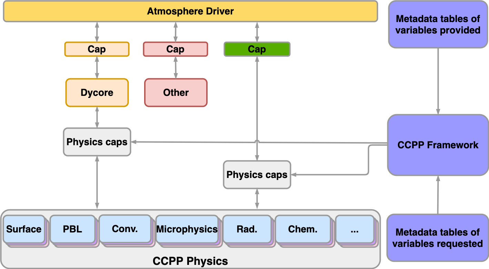

.. _Overview:

.. raw:: html

   

.. role:: bi
   :class: bold italic

.. role:: g
   :class: gray

.. role:: gb
   :class: bold gray

.. role:: gi
   :class: italic gray

.. role:: gbi
   :class: bold italic gray

*************************
CCPP Overview
*************************

Ideas for the Common Community Physics Package (:term:`CCPP`) originated within the Earth System Prediction Capability physics interoperability group (now the `Interagency Council for Advancing Meteorological Services; ICAMS <https://www.icams-portal.gov/>`_), which has representatives from the US National Center
for Atmospheric Research (:term:`NCAR`), the Navy, National Oceanic and Atmospheric Administration
(NOAA) Research Laboratories, NOAA National Weather Service, and other groups. Physics
interoperability, or the ability to run a given physics :term:`suite` in various :term:`host models <host model>`,
has been a goal of this multi-agency group for several years. An initial mechanism to
run the physics of NOAA’s :term:`Global Forecast System (GFS) <GFS>` model in other host models,
the Interoperable Physics Driver (IPD), was developed by the NOAA Environmental Modeling
Center (EMC) and later augmented by the NOAA Geophysical Fluid Dynamics Laboratory (GFDL).

The CCPP expanded on that work by meeting `additional requirements put forth by NOAA <https://dtcenter.org/sites/default/files/community-code/ccpp-requirements-historical.pdf>`_,
and brought new functionalities to the physics-dynamics interface. Those include
the ability to choose the order of :term:`parameterizations <parameterization>`, to :term:`subcycle <subcycling>` individual
parameterizations by running them more frequently than other parameterizations,
and to group arbitrary :term:`sets <set>` of parameterizations allowing other computations in
between them (e.g., dynamics and coupling computations). The IPD was phased out in
2021 in favor of the CCPP as a single way to interface with physics in the :term:`UFS`

The architecture of the CCPP and its connection to a host model is shown in
:numref:`Figure %s <ccpp_arch_host>`.
Two elements of the CCPP are highlighted: a library of physical parameterizations
(:term:`CCPP Physics`) that conforms to selected standards and an infrastructure (:term:`CCPP Framework`)
that enables connecting the physics to a host model. The third element (not shown)
is the CCPP Single-Column Model (:term:`SCM`), a simple host model that can be used with the CCPP
Physics and Framework.

.. _ccpp_arch_host:

   *Architecture of the CCPP and its connection to a host model,
   represented here as the driver for an atmospheric model (yellow box). The dynamical
   core (dycore), physics, and other aspects of the model (such as coupling) are
   connected to the driving host through the pool of* :term:`physics caps <physics cap>`. *The CCPP Physics is
   denoted by the gray box at the bottom of the physics, and encompasses the
   parameterizations, which are accompanied by physics caps.*

The host model needs to have functional documentation (metadata) for any variable that will be
passed to or received from the physics. The CCPP Framework is used to compare the variables
requested by each physical :term:`parameterization` against those provided by the host model [#]_, and
to check whether they are available, otherwise an error will be issued. This process serves
to expose the variables passed between physics and dynamics, and to clarify how information
is exchanged among parameterizations. During runtime, the CCPP Framework is responsible for
communicating the necessary variables between the host model and the parameterizations.

The CCPP Physics contains the parameterizations and suites that are used operationally in
the UFS Atmosphere, through the `Hurricane Analysis and Forecast System (HAFS) <https://wpo.noaa.gov/the-hurricane-analysis-and-forecast-system-hafs/>`_,
the `NOAA-EPA National Air Quality Forecast Capability (NAQFC) <https://www.emc.ncep.noaa.gov/mmb/aq/>`_,
and pre-operational prototypes of GFS version 17, planned for implementation in 2025. Additionally, the CCPP
contains dozens of suites and parameterizations that are used for both research and development for possible
transition to operations in the future. The CCPP aims to support the broad community
while benefiting from the community. In such a CCPP ecosystem
(:numref:`Figure %s <ccpp_ecosystem>`), the CCPP can be used not only by the operational
centers to produce official forecasts, but also by the research community to conduct
investigation and development. Innovations created and effectively tested by the research
community can be funneled back to the operational centers for further improvement of the
operational forecasts.

Both the CCPP Framework and the CCPP Physics are developed as open source code, follow
industry-standard code management practices, and are freely distributed through GitHub
(https://github.com/NCAR/ccpp-physics and https://github.com/NCAR/ccpp-framework).
This documentation is housed in repository https://github.com/NCAR/ccpp-doc.

.. _ccpp_ecosystem:

.. figure:: _static/CCPP_Ecosystem_Detailed-Diagram_only.png
   :align: center

   *CCPP ecosystem.*

The CCPP is governed by the groups that contribute to its development. The CCPP Physics code
management is collaboratively determined by NOAA, NCAR, and the Navy Research Laboratory (NRL),
and the DTC works with EMC and its sponsors to determine :term:`schemes <scheme>`
and suites to be included and supported. The governance of the CCPP Framework is jointly
undertaken by NOAA and NCAR (see more information at https://github.com/NCAR/ccpp-framework/wiki
and https://dtcenter.org/community-code/common-community-physics-package-ccpp).

The table below lists all parameterizations supported in CCPP public releases and the
`CCPP Scientific Documentation <https://dtcenter.ucar.edu/GMTB/v7.0.0p/sci_doc/index.html>`_
describes the parameterizations in detail. The parameterizations
are grouped in :term:`suites <suite>`, which determine the order and number of times each scheme is run within the host.

.. _scheme_suite_table:

.. table:: *Suites supported in the CCPP v7.0 release*

   +---------------------+------------+----------------+-----------------+-----------+-----------+
   | Physics Suite       | GFS_v16    | GFS_v16_RRTMGP |GFS_v17_p8_ugwpv1| WoFS_v0   | HRRR_gf   |
   +=====================+============+================+=================+===========+===========+
   | Microphysics        | GFDL       | GFDL           | Thompson        | NSSL      | Thompson  |
   +---------------------+------------+----------------+-----------------+-----------+-----------+
   | PBL                 | TKE EDMF   | TKE EDMF       | TKE EDMF        | MYNN-EDMF | MYNN-EDMF |
   +---------------------+------------+----------------+-----------------+-----------+-----------+
   | Deep convection     | saSAS      | saSAS          | saSAS           | :gi:`N/A` | GF        |
   +---------------------+------------+----------------+-----------------+-----------+-----------+
   | Shallow convection  | saMF       | saMF           | saMF            | :gi:`N/A` | :gi:`N/A` |
   +---------------------+------------+----------------+-----------------+-----------+-----------+
   | Radiation           | RRTMG      | RRTMGP         | RRTMG           | RRTMG     | RRTMG     |
   +---------------------+------------+----------------+-----------------+-----------+-----------+
   | Surface layer       | GFS        | GFS            | GFS             | MYNN-SFL  | MYNN-SFL  |
   +---------------------+------------+----------------+-----------------+-----------+-----------+
   | Gravity Wave Drag   | CIRES-uGWP | CIRES-uGWP     | Unified-uGWP    | CIRES-uGWP| GSL drag  |
   +---------------------+------------+----------------+-----------------+-----------+-----------+
   | Land surface        | Noah       | Noah           | Noah-MP         | Noah-MP   | RUC       |
   +---------------------+------------+----------------+-----------------+-----------+-----------+
   | Ozone               | NRL 2015   | NRL 2015       | NRL 2015        | NRL 2015  | NRL 2015  |
   +---------------------+------------+----------------+-----------------+-----------+-----------+
   | Strat H\ :sub:`2`\ O| NRL 2015   | NRL 2015       | NRL 2015        | NRL 2015  | NRL 2015  |
   +---------------------+------------+----------------+-----------------+-----------+-----------+
   | Ocean               | NSST       | NSST           | NSST            | NSST      | NSST      |
   +---------------------+------------+----------------+-----------------+-----------+-----------+

Only the suites that are currently supported by the CCPP team in the DTC are listed in the table. These suites were tested in the context of the Single-Column Model to verify that they work without error and produce realistic results for this release version; this is in addition to any testing that may occur in other dynamical cores by other groups.
Currently all supported suites use the 2015 Navy Research Laboratory (NRL) `ozone <https://dtcenter.ucar.edu/GMTB/v7.0.0p/sci_doc/_g_f_s__o_z_p_h_y_s.html>`_ and `stratospheric water vapor <https://dtcenter.ucar.edu/GMTB/v7.0.0p/sci_doc/_g_f_s__h2_o_p_h_y_s.html>`_ schemes,
and the `NSST <https://dtcenter.ucar.edu/GMTB/v4.0/sci_doc/GFS_NSST.html>`_ ocean scheme.

The GFS_v16 suite is meant to emulate the physics used by `version 16 <https://www.weather.gov/media/notification/pdf2/scn21-20gfs_v16.0_aac.pdf>`_ of the GFS model. It includes `GFDL microphysics <https://dtcenter.ucar.edu/GMTB/v7.0.0p/sci_doc/_g_f_d_l_cloud.html>`_,
the `Turbulent Kinetic Energy (TKE)-based Eddy Diffusivity Mass-Flux (EDMF) <https://dtcenter.ucar.edu/GMTB/v7.0.0p/sci_doc/_g_f_s__s_a_t_m_e_d_m_f_v_d_i_f_q.html>`_ planetary boundary layer (PBL) scheme,
`scale-aware (sa) Simplified Arakawa-Schubert (SAS) <https://dtcenter.ucar.edu/GMTB/v7.0.0p/sci_doc/_g_f_s__s_a_m_fdeep.html>`_ deep convection,
`scale-aware mass-flux (saMF) <https://dtcenter.ucar.edu/GMTB/v7.0.0p/sci_doc/_g_f_s__s_a_m_fshal.html>`_ shallow convection,
`Rapid Radiation Transfer Model for General Circulation Models (RRTMG) <https://dtcenter.ucar.edu/GMTB/v7.0.0p/sci_doc/_g_f_s__r_r_t_m_g_page.html>`_ radiation,
`GFS surface layer <https://dtcenter.ucar.edu/GMTB/v7.0.0p/sci_doc/_g_f_s__s_f_c_l_y_r.html>`_ scheme,
the `Cooperative Institute for Research in the Environmental Sciences (CIRES) unified gravity wave drag (uGWD) <https://dtcenter.ucar.edu/GMTB/v7.0.0p/sci_doc/_g_f_s__u_g_w_p_v0.html>`_ scheme,
and the `Noah Land Surface Model (LSM) <https://dtcenter.ucar.edu/GMTB/v7.0.0p/sci_doc/_g_f_s__n_o_a_h.html>`_.

GFS_v16_RRTMGP is identical to the GFS_v16 suite, but with the `RRTMGP <https://earth-system-radiation.github.io/rte-rrtmgp/>`_ radiation schemes rather than RRTMG.

The GFS_v17_p8_ugwpv1 suite is the latest (as of July 2024) proposed suite for the next operational GFS implementation (version 17), and features several differences from the GFS_v16 suite.
GFS_v17_p8_ugwpv1 utilizes `Thompson <https://dtcenter.ucar.edu/GMTB/v7.0.0p/sci_doc/_t_h_o_m_p_s_o_n.html>`_ Aerosol-Aware microphysics, `Unified uGWP <https://dtcenter.ucar.edu/GMTB/v7.0.0p/sci_doc/_g_f_s_ugwpv1_gsldrag.html>`_ gravity wave drag, and `Noah Multiparameterization (Noah-MP) <https://dtcenter.ucar.edu/GMTB/v7.0.0p/sci_doc/_noah_m_p.html>`_ land surface parameterization.

The WoFS_v0 suite has been used by the `Warn-on-Forecast System (WoFS) <https://wof.nssl.noaa.gov/>`_ project at the National Severe Storms Laboratory (NSSL) for real-time and potential future operational high-resolution modeling products.
This suite features `NSSL 2-moment <https://dtcenter.ucar.edu/GMTB/v7.0.0p/sci_doc/_n_s_s_l_m_i_c_r_o_page.html>`_ microphysics, `Mellor-Yamada-Nakanishi-Niino (MYNN) eddy diffusivity-mass flux (EDMF) <https://dtcenter.ucar.edu/GMTB/v7.0.0p/sci_doc/_m_y_n_n_e_d_m_f.html>`_ PBL, RRTMG radiation, `MYNN surface layer (SFL) <https://dtcenter.ucar.edu/GMTB/v7.0.0p/sci_doc/_s_f_c__m_y_n_n_s_f_l.html>`_ scheme, CIRES uGWD, and Noah-MP land surface (it does not feature convective parameterization).

Finally, the HRRR_gf suite was developed for use with prototypes of the `Rapid Refresh Forecast System (RRFS) <https://www.emc.ncep.noaa.gov/users/emc.campara/rrfs/>`_, and is similar to the physics used in the operational High-Resolution Rapid Refresh (HRRR) model physics package except with the implementation of deep convective parameterization.
This suite features Thompson Aerosol-Aware microphysics, MYNN-EDMF PBL physics, `Grell-Freitas deep convection <https://dtcenter.ucar.edu/GMTB/v7.0.0p/sci_doc/_c_u__g_f.html>`_, RRTMG radiation, MYNN SFL, the `Global Systems Laboratory (GSL) <https://dtcenter.ucar.edu/GMTB/v7.0.0p/sci_doc/_g_f_s_drag_suite.html>`_ gravity wave drag scheme, and the `Rapid Update Cycle (RUC) Land Surface Model <https://dtcenter.ucar.edu/GMTB/v7.0.0p/sci_doc/_r_u_c_l_s_m.html>`_.

In addition to the supported schemes listed above, there are several suites being used in various supported UFS applications, such as the UFS SRW Application and HAFS. While the CCPP team does not actively support these suites, support may be available from those respective applications where those suites are used.

.. [#] As of this writing, the CCPP is used and regularly tested with three host models: the CCPP
    SCM, the atmospheric component of NOAA’s Unified Forecast System (UFS) (hereafter the UFS Atmosphere) that utilizes
    the Finite-Volume Cubed Sphere (FV3) dynamical core, and the The Navy Environmental Prediction System Using the NUMA Core (NEPTUNE).
    The CCPP can be utilized with both
    global and limited-area configurations of the UFS Atmosphere, and is integrated with the UFS limited-area UFS Short-Range Weather (SRW) Application and the Hurricane Analysis and Forecast System (HAFS).
    Work is also underway to connect and validate the use of the CCPP Framework with NCAR models, particularly the Community Atmosphere Model - System for Integrated Modeling of the Atmosphere (CAM-SIMA).

Previous CCPP releases
=======================

The first public release of the CCPP took place in April 2018 and included all the
parameterizations of the operational GFS v14, along with the ability to connect to the
SCM. The second public release of the CCPP took place in August 2018 and additionally
included the physics suite tested for the implementation of GFS v15. The third public release of
the CCPP, in June 2019, had four suites: GFS_v15, corresponding to the GFS v15 model implemented operationally
in June 2019, and three developmental suites considered for
use in GFS v16 (GFS_v15plus with an alternate PBL scheme, csawmg with alternate convection and
microphysics schemes, and GFS_v0 with alternate convection, microphysics, PBL, and land surface schemes).

The CCPP v4.0 release, issued in March 2020, contained suite GFS_v15p2, which is an
updated version of the operational
GFS v15 and replaced suite GFS_v15. It also contained three developmental suites:
csawmg with minor updates, GSD_v1 (an update over the previously released GSD_v0),
and GFS_v16beta, which was the target suite at the time for implementation in the
upcoming operational GFSv16 (it replaced suite GFSv15plus). CCPP v4.0 was the first release supported for use with the UFS Weather Model, more specifically as part of the UFS Medium-Range Weather (MRW) Application.
The CCPP v4.1 release, issued in October 2020, was a minor
upgrade with the capability to build the code using Python 3 (previously only Python 2
was supported).

The CCPP v5.0 release, issued in February 2021, was a major
upgrade to enable use with the UFS Short-Range Weather (SRW) Application and the RRFS_v1alpha suite.

The CCPP v6.0 release, issued in June 2022, was a major upgrade in conjunction with the `UFS SRW v2.0 release <https://ufscommunity.org/announcing-the-ufs-short-range-weather-application-srw-app-v2-0-0-release/>`_.

The CCPP v7.0 release, issued in August 2024, was a major upgrade to physics and the Single-Column Model, particularly with the inclusion of the new `UFS Replay <https://ccpp-scm.readthedocs.io/en/latest/chap_cases.html#using-ufs-output-to-create-scm-cases-ufs-replay>`_ capability for running the SCM from UFS output.

Additional Resources
========================

For the latest version of the released code and additional documentation,
please visit the `DTC Website <https://dtcenter.org/community-code/common-community-physics-package-ccpp>`_.

Please post questions and comments to the GitHub discussions board for the relevant code repository:
 - CCPP Physics https://github.com/NCAR/ccpp-physics/discussions
 - CCPP Framework https://github.com/NCAR/ccpp-framework/discussions
 - Single-Column Model https://github.com/NCAR/ccpp-scm/discussions
 - UFS Weather Model https://github.com/ufs-community/ufs-weather-model/discussions

.. include:: Introduction.rst
